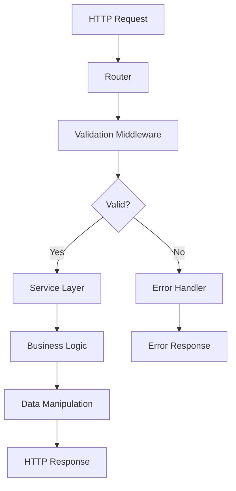

# Arquitectura del Sistema

## Visión General

El sistema implementa una arquitectura en capas que separa claramente las responsabilidades:

## Capas de la Aplicación

### 1. Capa de Presentación (Routes)
**Ubicación**: `routes/`

Responsable de:
- Definir endpoints HTTP
- Manejar peticiones y respuestas
- Aplicar middleware de validación
- Formatear respuestas JSON

**Ejemplo de implementación**:
```javascript
// routes/books.router.js
router.get('/:id',
  validatorHandler(getBooksSchema, 'params'),
  async (req, res) => {
    const { id } = req.params;
    const books = await service.findOne(id);
    res.json(books);
  }
);
```

### 2. Capa de Servicios (Services)
**Ubicación**: `services/`

Responsable de:
- Implementar lógica de negocio
- Gestionar el estado de los datos
- Operaciones CRUD asíncronas
- Manejo de errores de dominio

**Patrón de implementación**:
```javascript
class BooksService {
  constructor() {
    this.books = [];
    this.generate();
  }

  async create(data) { /* */ }
  async find() { /* */ }
  async findOne(id) { /* */ }
  async update(id, changes) { /* */ }
  async delete(id) { /* */ }
}
```

### 3. Capa de Validación (Schemas)
**Ubicación**: `schemas/`

Responsable de:
- Definir esquemas de validación con Joi
- Validar tipos de datos
- Establecer restricciones de negocio
- Generar mensajes de error descriptivos

**Ejemplo de esquema**:
```javascript
const createBooksSchema = Joi.object().keys({
  name: Joi.string().alphanum().min(3).max(15).required(),
  price: Joi.number().integer().min(1).required(),
});
```

### 4. Capa de Middleware
**Ubicación**: `middleware/`

Responsable de:
- Interceptar peticiones HTTP
- Aplicar validaciones transversales
- Manejar errores globalmente
- Formatear respuestas de error

## Flujo de Datos



## Middleware Pipeline

La aplicación implementa un pipeline de middleware que procesa las peticiones en orden:

1. **Express.json()** - Parsea JSON en el body
2. **Route Handler** - Ejecuta lógica específica de la ruta
3. **Validation Handler** - Valida datos usando esquemas Joi
4. **Error Handlers** (en orden):
   - `logErrors` - Registra errores en consola
   - `boomErrorHandler` - Maneja errores de Boom
   - `errorHandler` - Maneja errores genéricos

## Patrones de Diseño Implementados

### 1. Service Layer Pattern
- Encapsula lógica de negocio
- Separa controladores de la lógica de datos
- Facilita testing y reutilización

### 2. Middleware Pattern
- Intercepta peticiones HTTP
- Permite composición de funcionalidades
- Separa concerns transversales

### 3. Schema Validation Pattern
- Valida datos de entrada
- Centraliza reglas de validación
- Genera errores estructurados

### 4. Error Handling Chain
- Maneja errores de forma centralizada
- Proporciona diferentes niveles de manejo
- Formatea respuestas consistentes

## Convenciones de Arquitectura

### Naming Conventions
- **Routes**: `feature.router.js`
- **Services**: `feature.services.js` 
- **Schemas**: Agrupados en `validator.schema.js`
- **Middleware**: `action.handler.js`

### Import/Export Patterns
```javascript
// Export de servicios
module.exports = BooksService;

// Export de schemas
module.exports = { createSchema, updateSchema, getSchema };

// Export de middleware
module.exports = validatorHandler;

// Export múltiple de handlers
module.exports = { logErrors, errorHandler, boomErrorHandler };
```

### Response Patterns
```javascript
// Respuestas exitosas
res.json(data);              // Para objetos/arrays
res.send(string);            // Para strings simples
res.status(201).json(data);  // Para creación

// Manejo de errores
next(boom.badRequest(error)); // Errores de validación
throw new Error('message');   // Errores de servicio
```

## Extensibilidad

### Agregar Nueva Entidad
1. Crear servicio en `services/entity.services.js`
2. Definir esquemas en `schemas/validator.schema.js`
3. Crear router en `routes/entity.router.js`
4. Registrar en `routes/index.js`

### Agregar Middleware
1. Crear handler en `middleware/feature.handler.js`
2. Registrar en `index.js` o aplicar a rutas específicas
3. Mantener orden de middleware

### Integración con Base de Datos
- Los servicios están preparados para reemplazar arrays in-memory
- Mantener interfaz async/await
- Implementar manejo de errores de BD