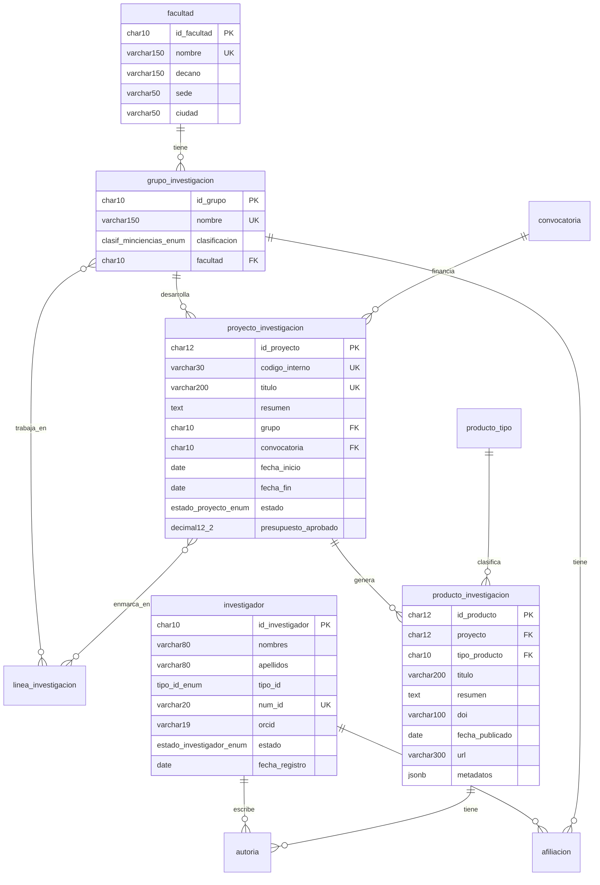

# Documentación de Base de Datos PostgreSQL

Esquema completo de la base de datos del sistema de gestión académica universitaria.

## 📊 Información General

- **Motor**: PostgreSQL 13+
- **Convenciones**: 
  - Nombres de tabla: singular (`investigador`, `proyecto_investigacion`)
  - Columnas: snake_case (`fecha_inicio`, `tipo_id`)
  - Claves primarias: formato char con prefijo descriptivo (`INV001`, `PROY001`)

## 🗂️ Modelo de Entidad-Relación



---

## 📋 Catálogos y ENUMs

### Tipos de Identificación
```sql
CREATE TYPE tipo_id_enum AS ENUM ('CC', 'TI', 'CE', 'PP');
-- CC: Cédula de Ciudadanía
-- TI: Tarjeta de Identidad  
-- CE: Cédula de Extranjería
-- PP: Pasaporte
```

### Estados de Investigador
```sql
CREATE TYPE estado_investigador_enum AS ENUM ('activo', 'inactivo');
```

### Categorías Docentes
```sql
CREATE TYPE categoria_prof_enum AS ENUM ('auxiliar', 'asistente', 'asociado', 'titular');
```

### Dedicaciones Docentes
```sql
CREATE TYPE dedicacion_prof_enum AS ENUM ('TC', 'MT', 'HC');
-- TC: Tiempo Completo
-- MT: Medio Tiempo  
-- HC: Hora Cátedra
```

### Clasificación Minciencias
```sql
CREATE TYPE clasif_minciencias_enum AS ENUM ('A1', 'A', 'B', 'C', 'Reconocido');
```

### Tipos de Convocatoria
```sql
CREATE TYPE convocatoria_tipo_enum AS ENUM ('interna', 'Minciencias', 'internacional', 'otra');
```

### Estados de Proyecto
```sql
CREATE TYPE estado_proyecto_enum AS ENUM ('propuesto', 'ejecución', 'finalizado', 'suspendido');
```

### Roles en Afiliación
```sql
CREATE TYPE rol_afiliacion_enum AS ENUM ('líder', 'coinvestigador', 'semillerista', 'asistente', 'administrativo');
```

### Roles de Autoría
```sql
CREATE TYPE rol_autor_enum AS ENUM ('autor', 'coautor', 'director');
```

### Etiquetas de Correo
```sql
CREATE TYPE etiqueta_correo_enum AS ENUM ('institucional', 'personal');
```

### Tipos de Teléfono
```sql
CREATE TYPE tel_tipo_enum AS ENUM ('móvil', 'fijo');
```

---

## 🏗️ DDL Completo

### 1. Entidades Core

#### Facultad
```sql
CREATE TABLE facultad (
    id_facultad CHAR(10) PRIMARY KEY,
    nombre VARCHAR(150) NOT NULL UNIQUE,
    decano VARCHAR(150) NOT NULL,
    sede VARCHAR(50) NOT NULL,
    ciudad VARCHAR(50) NOT NULL,
    
    -- Timestamps
    fecha_creacion TIMESTAMP DEFAULT CURRENT_TIMESTAMP,
    fecha_actualizacion TIMESTAMP DEFAULT CURRENT_TIMESTAMP
);

COMMENT ON TABLE facultad IS 'Facultades de la universidad';
```

#### Línea de Investigación
```sql
CREATE TABLE linea_investigacion (
    id_linea CHAR(10) PRIMARY KEY,
    nombre VARCHAR(150) NOT NULL UNIQUE,
    descripcion TEXT,
    
    -- Timestamps
    fecha_creacion TIMESTAMP DEFAULT CURRENT_TIMESTAMP,
    fecha_actualizacion TIMESTAMP DEFAULT CURRENT_TIMESTAMP
);

COMMENT ON TABLE linea_investigacion IS 'Líneas temáticas de investigación';
```

#### Tipo de Producto
```sql
CREATE TABLE producto_tipo (
    id_ptipo CHAR(10) PRIMARY KEY,
    nombre VARCHAR(120) NOT NULL UNIQUE,
    descripcion TEXT,
    categoria VARCHAR(50),
    
    -- Timestamps
    fecha_creacion TIMESTAMP DEFAULT CURRENT_TIMESTAMP,
    fecha_actualizacion TIMESTAMP DEFAULT CURRENT_TIMESTAMP
);

COMMENT ON TABLE producto_tipo IS 'Clasificación de productos de investigación';
```

#### Convocatoria
```sql
CREATE TABLE convocatoria (
    id_convocatoria CHAR(10) PRIMARY KEY,
    nombre VARCHAR(150) NOT NULL,
    tipo convocatoria_tipo_enum NOT NULL,
    entidad VARCHAR(150) NOT NULL,
    anio SMALLINT NOT NULL CHECK (anio >= 2000),
    fecha_apertura DATE,
    fecha_cierre DATE NOT NULL,
    monto_maximo DECIMAL(14,2),
    descripcion TEXT,
    requisitos TEXT,
    
    -- Constraints
    UNIQUE (nombre, anio, entidad),
    CHECK (fecha_cierre > fecha_apertura OR fecha_apertura IS NULL),
    
    -- Timestamps
    fecha_creacion TIMESTAMP DEFAULT CURRENT_TIMESTAMP,
    fecha_actualizacion TIMESTAMP DEFAULT CURRENT_TIMESTAMP
);

COMMENT ON TABLE convocatoria IS 'Convocatorias de financiación para proyectos';
```

### 2. Personas

#### Investigador
```sql
CREATE TABLE investigador (
    id_investigador CHAR(10) PRIMARY KEY,
    nombres VARCHAR(80) NOT NULL,
    apellidos VARCHAR(80) NOT NULL,
    tipo_id tipo_id_enum,
    num_id VARCHAR(20) UNIQUE,
    orcid VARCHAR(19),
    estado estado_investigador_enum NOT NULL DEFAULT 'activo',
    fecha_registro DATE NOT NULL DEFAULT CURRENT_DATE,
    
    -- Business constraints
    UNIQUE (nombres, apellidos),
    CHECK (orcid IS NULL OR LENGTH(orcid) = 19),
    
    -- Timestamps
    fecha_creacion TIMESTAMP DEFAULT CURRENT_TIMESTAMP,
    fecha_actualizacion TIMESTAMP DEFAULT CURRENT_TIMESTAMP
);

-- Tabla multivaluada: emails
CREATE TABLE investigador_correo (
    id_investigador CHAR(10) NOT NULL,
    email VARCHAR(120) NOT NULL,
    etiqueta etiqueta_correo_enum NOT NULL DEFAULT 'institucional',
    
    PRIMARY KEY (id_investigador, email),
    FOREIGN KEY (id_investigador) REFERENCES investigador(id_investigador) ON DELETE CASCADE,
    CHECK (POSITION('@' IN email) > 1)
);

-- Tabla multivaluada: teléfonos
CREATE TABLE investigador_telefono (
    id_investigador CHAR(10) NOT NULL,
    numero VARCHAR(20) NOT NULL,
    tipo tel_tipo_enum NOT NULL DEFAULT 'móvil',
    
    PRIMARY KEY (id_investigador, numero),
    FOREIGN KEY (id_investigador) REFERENCES investigador(id_investigador) ON DELETE CASCADE
);

COMMENT ON TABLE investigador IS 'Investigadores registrados en el sistema';
```

#### Profesor
```sql
CREATE TABLE profesor (
    id_profesor CHAR(10) PRIMARY KEY,
    nombres VARCHAR(80) NOT NULL,
    apellidos VARCHAR(80) NOT NULL,
    tipo_id tipo_id_enum,
    num_id VARCHAR(20) NOT NULL,
    correo_institucional VARCHAR(120),
    telefono VARCHAR(20),
    fecha_nacimiento DATE NOT NULL,
    categoria categoria_prof_enum,
    dedicacion dedicacion_prof_enum,
    departamento VARCHAR(100) NOT NULL,
    
    -- Business constraints
    UNIQUE (tipo_id, num_id),
    UNIQUE (correo_institucional),
    CHECK (correo_institucional IS NULL OR POSITION('@' IN correo_institucional) > 1),
    CHECK (fecha_nacimiento < CURRENT_DATE),
    
    -- Timestamps
    fecha_creacion TIMESTAMP DEFAULT CURRENT_TIMESTAMP,
    fecha_actualizacion TIMESTAMP DEFAULT CURRENT_TIMESTAMP
);

-- Tabla multivaluada: correos adicionales
CREATE TABLE profesor_correo_adicional (
    id_profesor CHAR(10) NOT NULL,
    email VARCHAR(120) NOT NULL,
    
    PRIMARY KEY (id_profesor, email),
    FOREIGN KEY (id_profesor) REFERENCES profesor(id_profesor) ON DELETE CASCADE,
    CHECK (POSITION('@' IN email) > 1)
);

COMMENT ON TABLE profesor IS 'Profesores de la universidad';
```

#### Estudiante
```sql
CREATE TABLE estudiante (
    id_estudiante CHAR(10) PRIMARY KEY,
    nombres VARCHAR(50) NOT NULL,
    apellidos VARCHAR(50) NOT NULL,
    tipo_id tipo_id_enum,
    num_id VARCHAR(20) UNIQUE,
    codigo_estudiantil CHAR(12) UNIQUE,
    programa VARCHAR(120),
    nivel estudiante_nivel_enum NOT NULL,
    semestre SMALLINT CHECK (semestre BETWEEN 1 AND 10),
    correo_institucional VARCHAR(100) NOT NULL UNIQUE,
    
    -- Business constraints
    CHECK (POSITION('@' IN correo_institucional) > 1),
    
    -- Timestamps
    fecha_creacion TIMESTAMP DEFAULT CURRENT_TIMESTAMP,
    fecha_actualizacion TIMESTAMP DEFAULT CURRENT_TIMESTAMP
);

-- Enum para niveles de estudiante
CREATE TYPE estudiante_nivel_enum AS ENUM ('pregrado', 'maestría', 'doctorado');

COMMENT ON TABLE estudiante IS 'Estudiantes de programas académicos';
```

### 3. Estructura Académica

#### Grupo de Investigación
```sql
CREATE TABLE grupo_investigacion (
    id_grupo CHAR(10) PRIMARY KEY,
    nombre VARCHAR(150) NOT NULL UNIQUE,
    clasificacion clasif_minciencias_enum,
    facultad CHAR(10) NOT NULL,
    descripcion TEXT,
    fecha_creacion_grupo DATE,
    
    -- Foreign keys
    FOREIGN KEY (facultad) REFERENCES facultad(id_facultad),
    
    -- Timestamps
    fecha_creacion TIMESTAMP DEFAULT CURRENT_TIMESTAMP,
    fecha_actualizacion TIMESTAMP DEFAULT CURRENT_TIMESTAMP
);

-- Tabla de relación: Grupo - Líneas de Investigación
CREATE TABLE grupo_linea (
    id_grupo CHAR(10) NOT NULL,
    id_linea CHAR(10) NOT NULL,
    fecha_asociacion DATE DEFAULT CURRENT_DATE,
    
    PRIMARY KEY (id_grupo, id_linea),
    FOREIGN KEY (id_grupo) REFERENCES grupo_investigacion(id_grupo) ON DELETE CASCADE,
    FOREIGN KEY (id_linea) REFERENCES linea_investigacion(id_linea) ON DELETE CASCADE
);

COMMENT ON TABLE grupo_investigacion IS 'Grupos de investigación institucionales';
```

### 4. Proyectos y Productos

#### Proyecto de Investigación
```sql
CREATE TABLE proyecto_investigacion (
    id_proyecto CHAR(12) PRIMARY KEY,
    codigo_interno VARCHAR(30) UNIQUE,
    titulo VARCHAR(200) NOT NULL UNIQUE,
    resumen TEXT,
    objetivo_general TEXT,
    objetivos_especificos TEXT,
    metodologia TEXT,
    grupo CHAR(10),
    convocatoria CHAR(10),
    fecha_inicio DATE NOT NULL,
    fecha_fin DATE,
    estado estado_proyecto_enum NOT NULL DEFAULT 'propuesto',
    presupuesto_aprobado DECIMAL(12,2),
    
    -- Foreign keys
    FOREIGN KEY (grupo) REFERENCES grupo_investigacion(id_grupo),
    FOREIGN KEY (convocatoria) REFERENCES convocatoria(id_convocatoria),
    
    -- Business constraints
    CHECK (fecha_fin IS NULL OR fecha_fin >= fecha_inicio),
    CHECK (presupuesto_aprobado IS NULL OR presupuesto_aprobado >= 0),
    
    -- Timestamps
    fecha_creacion TIMESTAMP DEFAULT CURRENT_TIMESTAMP,
    fecha_actualizacion TIMESTAMP DEFAULT CURRENT_TIMESTAMP
);

-- Tabla de relación: Proyecto - Líneas de Investigación
CREATE TABLE proyecto_linea (
    id_proyecto CHAR(12) NOT NULL,
    id_linea CHAR(10) NOT NULL,
    
    PRIMARY KEY (id_proyecto, id_linea),
    FOREIGN KEY (id_proyecto) REFERENCES proyecto_investigacion(id_proyecto) ON DELETE CASCADE,
    FOREIGN KEY (id_linea) REFERENCES linea_investigacion(id_linea) ON DELETE CASCADE
);

COMMENT ON TABLE proyecto_investigacion IS 'Proyectos de investigación desarrollados';
```

#### Producto de Investigación
```sql
CREATE TABLE producto_investigacion (
    id_producto CHAR(12) PRIMARY KEY,
    proyecto CHAR(12),
    tipo_producto CHAR(10),
    titulo VARCHAR(200) NOT NULL,
    resumen TEXT,
    doi VARCHAR(100),
    isbn VARCHAR(17),
    fecha_publicado DATE NOT NULL,
    url VARCHAR(300),
    metadatos JSONB,
    
    -- Foreign keys
    FOREIGN KEY (proyecto) REFERENCES proyecto_investigacion(id_proyecto) ON DELETE SET NULL,
    FOREIGN KEY (tipo_producto) REFERENCES producto_tipo(id_ptipo),
    
    -- Business constraints
    CHECK (fecha_publicado <= CURRENT_DATE),
    CHECK (doi IS NULL OR LENGTH(doi) <= 100),
    CHECK (isbn IS NULL OR LENGTH(REPLACE(isbn, '-', '')) IN (10, 13)),
    
    -- Timestamps
    fecha_creacion TIMESTAMP DEFAULT CURRENT_TIMESTAMP,
    fecha_actualizacion TIMESTAMP DEFAULT CURRENT_TIMESTAMP
);

COMMENT ON TABLE producto_investigacion IS 'Productos generados por proyectos de investigación';
COMMENT ON COLUMN producto_investigacion.metadatos IS 'Metadatos específicos del tipo de producto en formato JSON';
```

### 5. Relaciones

#### Afiliación (Investigador - Grupo)
```sql
CREATE TABLE afiliacion (
    id_afiliacion CHAR(10) PRIMARY KEY,
    investigador CHAR(10) NOT NULL,
    grupo CHAR(10) NOT NULL,
    rol rol_afiliacion_enum NOT NULL,
    fecha_inicio DATE NOT NULL DEFAULT CURRENT_DATE,
    fecha_fin DATE,
    observaciones TEXT,
    
    -- Foreign keys
    FOREIGN KEY (investigador) REFERENCES investigador(id_investigador),
    FOREIGN KEY (grupo) REFERENCES grupo_investigacion(id_grupo),
    
    -- Business constraints
    UNIQUE (investigador, grupo, fecha_inicio),
    CHECK (fecha_fin IS NULL OR fecha_fin >= fecha_inicio),
    
    -- Timestamps
    fecha_creacion TIMESTAMP DEFAULT CURRENT_TIMESTAMP,
    fecha_actualizacion TIMESTAMP DEFAULT CURRENT_TIMESTAMP
);

COMMENT ON TABLE afiliacion IS 'Relación de investigadores con grupos de investigación';
```

#### Autoría (Investigador - Producto)
```sql
CREATE TABLE autoria (
    id_autoria CHAR(10) PRIMARY KEY,
    investigador CHAR(10) NOT NULL,
    producto CHAR(12) NOT NULL,
    orden_autor SMALLINT,
    rol_autor rol_autor_enum,
    porcentaje_participacion DECIMAL(5,2),
    observaciones TEXT,
    
    -- Foreign keys
    FOREIGN KEY (investigador) REFERENCES investigador(id_investigador),
    FOREIGN KEY (producto) REFERENCES producto_investigacion(id_producto) ON DELETE CASCADE,
    
    -- Business constraints
    UNIQUE (producto, orden_autor),
    CHECK (orden_autor IS NULL OR orden_autor > 0),
    CHECK (porcentaje_participacion IS NULL OR porcentaje_participacion BETWEEN 0 AND 100),
    
    -- Timestamps
    fecha_creacion TIMESTAMP DEFAULT CURRENT_TIMESTAMP,
    fecha_actualizacion TIMESTAMP DEFAULT CURRENT_TIMESTAMP
);

COMMENT ON TABLE autoria IS 'Autoría de investigadores en productos de investigación';
```

---

## 📈 Índices para Optimización

```sql
-- Búsquedas frecuentes por investigadores
CREATE INDEX idx_investigador_apellidos_nombres ON investigador(apellidos, nombres);
CREATE INDEX idx_investigador_estado ON investigador(estado);

-- Búsquedas por profesor
CREATE INDEX idx_profesor_departamento ON profesor(departamento);
CREATE INDEX idx_profesor_categoria ON profesor(categoria);

-- Búsquedas por proyectos
CREATE INDEX idx_proyecto_estado ON proyecto_investigacion(estado);
CREATE INDEX idx_proyecto_grupo ON proyecto_investigacion(grupo);
CREATE INDEX idx_proyecto_fecha_inicio ON proyecto_investigacion(fecha_inicio);

-- Búsquedas por productos
CREATE INDEX idx_producto_fecha_publicado ON producto_investigacion(fecha_publicado);
CREATE INDEX idx_producto_tipo ON producto_investigacion(tipo_producto);
CREATE INDEX idx_producto_proyecto ON producto_investigacion(proyecto);

-- Búsquedas por afiliaciones
CREATE INDEX idx_afiliacion_grupo ON afiliacion(grupo);
CREATE INDEX idx_afiliacion_investigador ON afiliacion(investigador);
CREATE INDEX idx_afiliacion_rol ON afiliacion(rol);

-- Índices para JSONB metadata
CREATE INDEX idx_producto_metadata_gin ON producto_investigacion USING GIN (metadatos);

-- Índices únicos compuestos
CREATE UNIQUE INDEX idx_convocatoria_unique ON convocatoria(nombre, anio, entidad);
```

---

## 🔧 Funciones y Triggers

### Función para actualizar timestamp
```sql
CREATE OR REPLACE FUNCTION update_fecha_actualizacion()
RETURNS TRIGGER AS $$
BEGIN
    NEW.fecha_actualizacion = CURRENT_TIMESTAMP;
    RETURN NEW;
END;
$$ LANGUAGE plpgsql;
```

### Triggers para todas las tablas principales
```sql
-- Trigger para investigador
CREATE TRIGGER trg_investigador_update
    BEFORE UPDATE ON investigador
    FOR EACH ROW
    EXECUTE FUNCTION update_fecha_actualizacion();

-- Trigger para profesor
CREATE TRIGGER trg_profesor_update
    BEFORE UPDATE ON profesor
    FOR EACH ROW
    EXECUTE FUNCTION update_fecha_actualizacion();

-- Trigger para proyecto_investigacion
CREATE TRIGGER trg_proyecto_update
    BEFORE UPDATE ON proyecto_investigacion
    FOR EACH ROW
    EXECUTE FUNCTION update_fecha_actualizacion();

-- Trigger para producto_investigacion
CREATE TRIGGER trg_producto_update
    BEFORE UPDATE ON producto_investigacion
    FOR EACH ROW
    EXECUTE FUNCTION update_fecha_actualizacion();

-- (Repetir para todas las tablas principales)
```

### Función para validar afiliaciones activas
```sql
CREATE OR REPLACE FUNCTION validar_afiliacion_activa()
RETURNS TRIGGER AS $$
BEGIN
    -- Verificar que no haya otra afiliación activa para el mismo investigador en el mismo grupo
    IF EXISTS (
        SELECT 1 FROM afiliacion 
        WHERE investigador = NEW.investigador 
        AND grupo = NEW.grupo 
        AND fecha_fin IS NULL 
        AND id_afiliacion != COALESCE(NEW.id_afiliacion, '')
    ) THEN
        RAISE EXCEPTION 'El investigador ya tiene una afiliación activa en este grupo';
    END IF;
    
    RETURN NEW;
END;
$$ LANGUAGE plpgsql;

CREATE TRIGGER trg_validar_afiliacion
    BEFORE INSERT OR UPDATE ON afiliacion
    FOR EACH ROW
    EXECUTE FUNCTION validar_afiliacion_activa();
```

---

## 🎯 Vistas Útiles

### Vista: Investigadores con su información de contacto
```sql
CREATE VIEW v_investigador_completo AS
SELECT 
    i.id_investigador,
    i.nombres,
    i.apellidos,
    i.tipo_id,
    i.num_id,
    i.orcid,
    i.estado,
    i.fecha_registro,
    
    -- Emails como array
    ARRAY(
        SELECT ic.email 
        FROM investigador_correo ic 
        WHERE ic.id_investigador = i.id_investigador
    ) AS emails,
    
    -- Teléfonos como array
    ARRAY(
        SELECT it.numero 
        FROM investigador_telefono it 
        WHERE it.id_investigador = i.id_investigador
    ) AS telefonos
    
FROM investigador i;
```

### Vista: Proyectos con información del grupo y convocatoria
```sql
CREATE VIEW v_proyecto_completo AS
SELECT 
    p.id_proyecto,
    p.codigo_interno,
    p.titulo,
    p.estado,
    p.fecha_inicio,
    p.fecha_fin,
    p.presupuesto_aprobado,
    
    -- Información del grupo
    g.nombre AS grupo_nombre,
    f.nombre AS facultad_nombre,
    
    -- Información de convocatoria
    c.nombre AS convocatoria_nombre,
    c.tipo AS convocatoria_tipo,
    
    -- Líneas de investigación como array
    ARRAY(
        SELECT li.nombre 
        FROM proyecto_linea pl 
        JOIN linea_investigacion li ON pl.id_linea = li.id_linea
        WHERE pl.id_proyecto = p.id_proyecto
    ) AS lineas_investigacion
    
FROM proyecto_investigacion p
LEFT JOIN grupo_investigacion g ON p.grupo = g.id_grupo
LEFT JOIN facultad f ON g.facultad = f.id_facultad
LEFT JOIN convocatoria c ON p.convocatoria = c.id_convocatoria;
```

### Vista: Estadísticas por grupo
```sql
CREATE VIEW v_estadisticas_grupo AS
SELECT 
    g.id_grupo,
    g.nombre,
    g.clasificacion,
    f.nombre AS facultad,
    
    -- Conteo de miembros activos
    COUNT(DISTINCT CASE WHEN a.fecha_fin IS NULL THEN a.investigador END) AS miembros_activos,
    
    -- Conteo de proyectos
    COUNT(DISTINCT p.id_proyecto) AS total_proyectos,
    COUNT(DISTINCT CASE WHEN p.estado = 'ejecución' THEN p.id_proyecto END) AS proyectos_activos,
    
    -- Conteo de productos
    COUNT(DISTINCT pr.id_producto) AS total_productos,
    
    -- Presupuesto total
    COALESCE(SUM(p.presupuesto_aprobado), 0) AS presupuesto_total
    
FROM grupo_investigacion g
LEFT JOIN facultad f ON g.facultad = f.id_facultad
LEFT JOIN afiliacion a ON g.id_grupo = a.grupo
LEFT JOIN proyecto_investigacion p ON g.id_grupo = p.grupo
LEFT JOIN producto_investigacion pr ON p.id_proyecto = pr.proyecto
GROUP BY g.id_grupo, g.nombre, g.clasificacion, f.nombre;
```

---

## 📊 Datos de Ejemplo

### Inserción de datos básicos
```sql
-- Facultades
INSERT INTO facultad (id_facultad, nombre, decano, sede, ciudad) VALUES
('FAC001', 'Facultad de Ingeniería', 'Dr. Juan Pérez', 'Sede Central', 'Bogotá'),
('FAC002', 'Facultad de Ciencias', 'Dra. María García', 'Sede Norte', 'Medellín');

-- Líneas de investigación
INSERT INTO linea_investigacion (id_linea, nombre) VALUES
('LIN001', 'Inteligencia Artificial'),
('LIN002', 'Desarrollo de Software'),
('LIN003', 'Biotecnología');

-- Tipos de producto
INSERT INTO producto_tipo (id_ptipo, nombre, categoria) VALUES
('ART001', 'Artículo de revista', 'Publicación científica'),
('LIB001', 'Libro', 'Publicación científica'),
('PON001', 'Ponencia', 'Evento científico');

-- Investigadores
INSERT INTO investigador (id_investigador, nombres, apellidos, tipo_id, num_id, estado, fecha_registro) VALUES
('INV001', 'Ana María', 'González López', 'CC', '12345678', 'activo', '2023-01-15'),
('INV002', 'Carlos Eduardo', 'Rodríguez Silva', 'CC', '87654321', 'activo', '2023-02-20');

-- Emails de investigadores
INSERT INTO investigador_correo (id_investigador, email, etiqueta) VALUES
('INV001', 'ana.gonzalez@universidad.edu.co', 'institucional'),
('INV001', 'ana.personal@gmail.com', 'personal');

-- Grupos de investigación
INSERT INTO grupo_investigacion (id_grupo, nombre, clasificacion, facultad) VALUES
('GRP001', 'Grupo de Inteligencia Artificial', 'A1', 'FAC001'),
('GRP002', 'Grupo de Biotecnología Aplicada', 'A', 'FAC002');
```

---

## 🔍 Consultas de Ejemplo

### Consulta: Investigadores más productivos
```sql
SELECT 
    i.nombres,
    i.apellidos,
    COUNT(a.id_autoria) AS total_productos,
    COUNT(CASE WHEN a.rol_autor = 'autor' THEN 1 END) AS como_autor_principal
FROM investigador i
JOIN autoria a ON i.id_investigador = a.investigador
JOIN producto_investigacion p ON a.producto = p.id_producto
WHERE p.fecha_publicado >= '2020-01-01'
GROUP BY i.id_investigador, i.nombres, i.apellidos
ORDER BY total_productos DESC
LIMIT 10;
```

### Consulta: Proyectos próximos a finalizar
```sql
SELECT 
    p.titulo,
    p.fecha_fin,
    g.nombre AS grupo,
    p.estado,
    EXTRACT(DAY FROM (p.fecha_fin - CURRENT_DATE)) AS dias_restantes
FROM proyecto_investigacion p
JOIN grupo_investigacion g ON p.grupo = g.id_grupo
WHERE p.fecha_fin BETWEEN CURRENT_DATE AND CURRENT_DATE + INTERVAL '30 days'
AND p.estado = 'ejecución'
ORDER BY p.fecha_fin;
```

### Consulta: Estadísticas de producción por año
```sql
SELECT 
    EXTRACT(YEAR FROM pr.fecha_publicado) AS año,
    pt.nombre AS tipo_producto,
    COUNT(*) AS cantidad,
    COUNT(DISTINCT pr.proyecto) AS proyectos_involucrados
FROM producto_investigacion pr
JOIN producto_tipo pt ON pr.tipo_producto = pt.id_ptipo
WHERE pr.fecha_publicado >= '2020-01-01'
GROUP BY EXTRACT(YEAR FROM pr.fecha_publicado), pt.nombre
ORDER BY año DESC, cantidad DESC;
```

---

## 🛡️ Seguridad y Permisos

### Roles de base de datos
```sql
-- Rol de solo lectura para reportes
CREATE ROLE academic_reader;
GRANT SELECT ON ALL TABLES IN SCHEMA public TO academic_reader;

-- Rol para coordinadores de investigación
CREATE ROLE research_coordinator;
GRANT SELECT, INSERT, UPDATE ON ALL TABLES IN SCHEMA public TO research_coordinator;
GRANT DELETE ON afiliacion, autoria TO research_coordinator;

-- Rol administrativo completo
CREATE ROLE academic_admin;
GRANT ALL PRIVILEGES ON ALL TABLES IN SCHEMA public TO academic_admin;
GRANT ALL PRIVILEGES ON ALL SEQUENCES IN SCHEMA public TO academic_admin;
```

### Políticas de seguridad a nivel de fila (RLS)
```sql
-- Habilitar RLS en tablas sensibles
ALTER TABLE investigador ENABLE ROW LEVEL SECURITY;

-- Política: Los investigadores solo pueden ver sus propios datos
CREATE POLICY investigador_own_data ON investigador
    FOR ALL
    TO academic_user
    USING (id_investigador = current_setting('app.current_investigador_id'));
```

---

Este esquema está optimizado para el contexto académico colombiano y sigue las mejores prácticas de diseño de bases de datos PostgreSQL.
